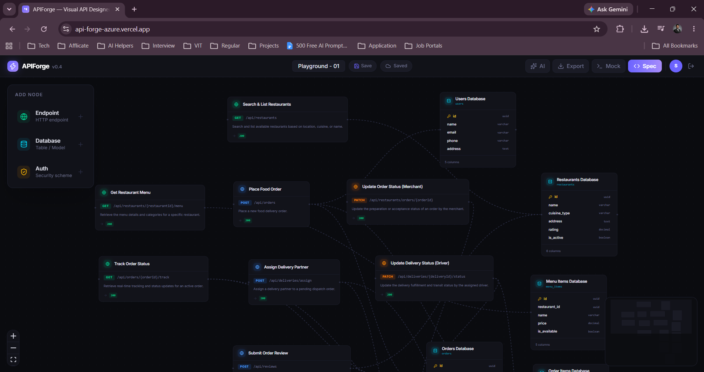
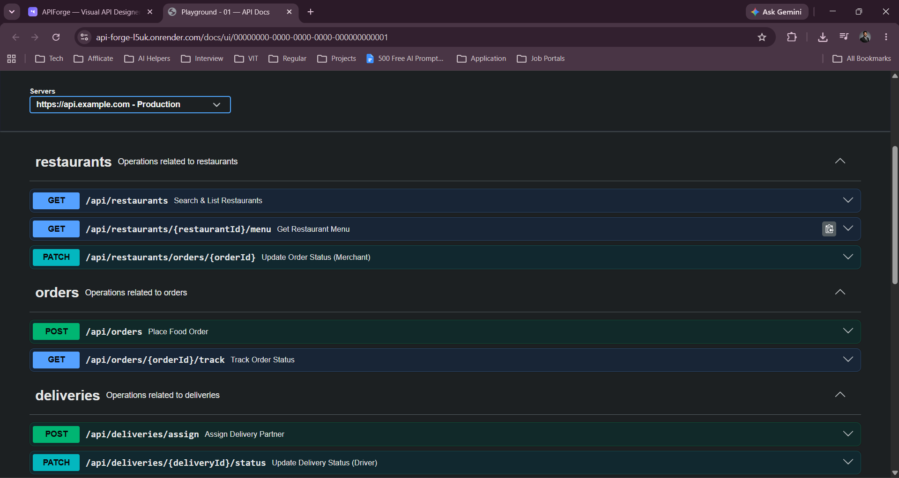
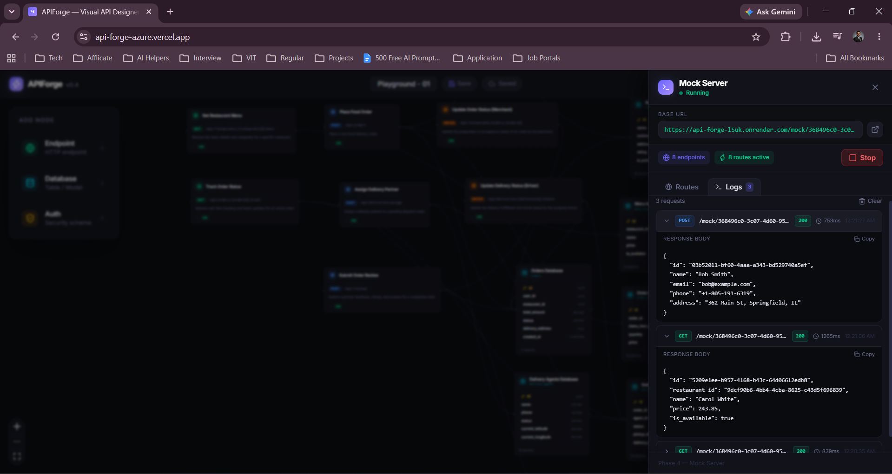
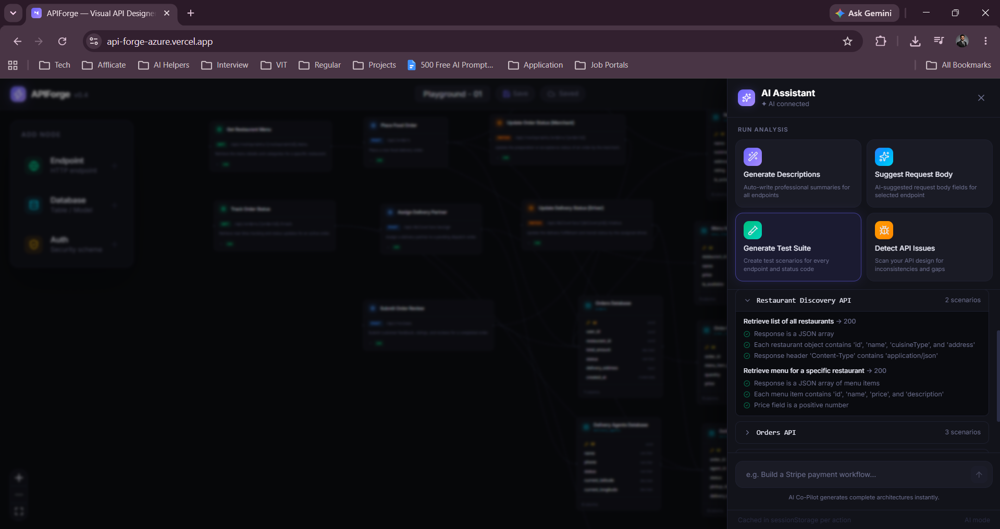
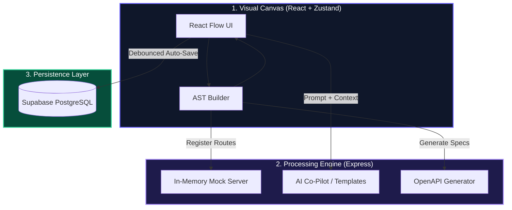

# ⚡ APIForge — Visual API Designer & Mock Engine

> Design, mock, test, and document production-ready APIs visually — with or without an AI key.

[](https://api-forge-azure.vercel.app/)


👉 **Try the Live App:** [https://api-forge-azure.vercel.app/](https://api-forge-azure.vercel.app/)

---

## 🌟 Overview

**APIForge** is an open-source, visual API design workspace. It bridges the gap between architecture planning and API execution by allowing software engineers and technical teams to design endpoints, attach database schemas, configure security models, and instantly spin up live mock servers — all within an interactive node-based canvas.

Projects are persisted to **Supabase PostgreSQL** for authenticated users, with automatic fallback to `localStorage` for guests. The backend is secured with API key authentication and per-route rate limiting.

---

## 📸 Sneak Peek

<table>
  <tr>
    <td align="center">
      <b>The Visual Canvas</b><br/>
      <sub>Drag and drop nodes to visually design your APIs.</sub><br/><br/>
      
    </td>
    <td align="center">
      <b>The Swagger UI</b><br/>
      <sub>Live, generated interactive API documentation.</sub><br/><br/>
      
    </td>
  </tr>
  <tr>
    <td align="center">
      <b>The Mock Panel</b><br/>
      <sub>Test generated endpoints with the in-memory server.</sub><br/><br/>
      
    </td>
    <td align="center">
      <b>API Test Suite</b><br/>
      <sub>Generate full test suites with multi-scenario assertions.</sub><br/><br/>
      
    </td>
  </tr>
</table>

---

## ✨ Key Features

| Feature | Description |
|---|---|
| 🎨 **Visual Node Canvas** | Drag-and-drop Endpoint, Database, and Auth nodes using React Flow |
| 🔐 **Auth & Persistence** | Sign in / sign up / guest mode — projects saved to Supabase (PostgreSQL + RLS) |
| 🧠 **Smart Hydration** | Canvas state loads from cloud before auto-save fires — no race conditions |
| 🧪 **Instant Mock Server** | In-memory Express mock engine with schema-faking and latency simulation |
| 🤖 **AI Co-Pilot** | Architecture generation, endpoint descriptions, test synthesis & issue detection |
| 📋 **OpenAPI 3.0.3 Generator** | Real-time visual-to-spec conversion (YAML & JSON) |
| 📦 **Multi-Format Export** | OpenAPI 3.0, Postman Collection v2.1, Markdown documentation |
| 📖 **Integrated Swagger UI** | Live, custom-themed API documentation viewer |
| 🛡️ **API Key Auth Middleware** | Backend routes protected via X-API-Key header in production |
| 🚦 **AI Rate Limiting** | Configurable per-minute rate limit on AI routes (express-rate-limit) |

---

## 🏗️ Architecture & Data Flow

### 1. Repository Structure

```text
api-forge/
├── frontend/                   # React 19 + TypeScript + Vite + React Flow
│   └── src/
│       ├── components/         # UI panels (AIPanel, SpecViewer, MockPanel, ExportPanel, AuthModal)
│       ├── generators/         # AST builder, OpenAPI generator, Postman builder, Markdown generator
│       ├── hooks/              # useAuth, useMockServer, useProject
│       ├── inspector/          # Node property inspector panels
│       ├── nodes/              # React Flow custom node components (Endpoint, Database, Auth)
│       ├── stores/             # Zustand canvas state store
│       └── lib/                # Supabase client configuration
├── backend/                    # Node.js + Express 5 REST API & Mock Engine
│   └── src/
│       ├── ai/                 # AI service (Gemini/OpenAI + template fallbacks)
│       ├── middleware/         # API key authentication middleware
│       ├── mock/               # In-memory Express router generator & schema faker
│       └── routes/             # openapi, mock, ai, docs route handlers
├── .env.example
├── LICENSE
└── README.md
```

### 2. System Architecture



---

## 🚀 Quick Start

### Prerequisites

- **Node.js**: v18.0.0 or higher
- **npm**: v9.0.0 or higher

### 1. Clone & Install

```bash
git clone https://github.com/Sugandhan-S/api-forge.git
cd api-forge
cd backend && npm install
cd ../frontend && npm install
```

### 2. Environment Setup

```bash
cd backend && cp .env.example .env
cd ../frontend && cp .env.example .env
```

**Backend .env keys:**

| Variable | Description | Required |
|---|---|---|
| `PORT` | Server port (default: 3001) | No |
| `CORS_ORIGIN` | Comma-separated allowed origins | No |
| `API_SECRET_KEY` | API key for protected routes in production | No (open in dev) |
| `OPENAI_API_KEY` | OpenAI / Gemini API key for AI features | No (uses templates) |
| `OPENAI_BASE_URL` | Custom LLM base URL (e.g., Gemini endpoint) | No |
| `OPENAI_MODEL` | Model name (default: gemini-3.5-flash) | No |
| `AI_RATE_LIMIT` | Max AI requests per minute per IP (default: 10) | No |

**Frontend .env keys:**

| Variable | Description | Required |
|---|---|---|
| `VITE_SUPABASE_URL` | Your Supabase project URL | No (guest mode fallback) |
| `VITE_SUPABASE_ANON_KEY` | Your Supabase anon public key | No (guest mode fallback) |
| `VITE_API_URL` | Backend base URL (default: http://localhost:3001) | No |
| `VITE_API_SECRET_KEY` | API key sent in X-API-Key header | No |

> All variables are optional for local development. The app runs fully in guest mode with localStorage persistence if Supabase is not configured.

### 3. Run Dev Servers

```bash
# Terminal 1
cd backend && npm run dev

# Terminal 2
cd frontend && npm run dev
```

Visit **http://localhost:5173** to launch APIForge.

---

## 🔐 Authentication & Persistence

| Mode | Persistence | Auth |
|---|---|---|
| **Signed In** | Supabase PostgreSQL (per-user, RLS) | Supabase Auth (email + password) |
| **Guest** | Browser localStorage | None |
| **No Supabase** | Browser localStorage | Auto guest mode |

---

## 🛡️ Backend Security

- **API Key Middleware**: `/api/mock`, `/api/ai`, `/docs` require `X-API-Key` header in production. Bypassed transparently in dev when `API_SECRET_KEY` is unset.
- **AI Rate Limiting**: `/api/ai/run` throttled via `express-rate-limit` — configurable with `AI_RATE_LIMIT`.
- **Flexible CORS**: Origins set via `CORS_ORIGIN`. Vercel preview deployments (`*.vercel.app`) are whitelisted automatically.
- **Input Validation**: Mock and OpenAPI routes validate required fields (`openapi`, `info`, `paths`) before processing.
- **XSS-Safe Docs**: Swagger UI endpoint sanitizes spec content via `escapeHtml` and `escapeJsString` before HTML injection.

---

## 🤖 AI Co-Pilot

**With `OPENAI_API_KEY` (LLM mode):**
- Generate full API architectures from a plain-English prompt (endpoints + databases + edges)
- Auto-write professional endpoint descriptions
- Suggest request body schemas from linked database node properties
- Generate full test suites with multi-scenario assertions
- AI-powered fix suggestions for detected design issues

**Without an API key (template fallback mode):**
- Template-based endpoint description generation (resource-aware, method-specific)
- Schema-aware request body suggestions from connected database nodes
- Static issue detection: missing descriptions, undefined request bodies, absent error codes, missing auth
- Test case synthesis from defined status codes — zero AI required

Supported actions: `describe`, `suggest-body`, `generate-tests`, `detect-issues`, `generate-architecture`.

---

## 🧪 Mock Server

1. Frontend sends an OpenAPI 3.0 spec to `POST /api/mock/start`
2. Engine registers in-memory Express routes for every endpoint path
3. Schema-faking returns type-accurate synthetic JSON matching your schemas
4. Optional latency simulation for realistic frontend testing
5. Requests served at `http://localhost:3001/mock/:projectId/*`
6. Sessions torn down via `DELETE /api/mock/stop/:projectId`

Query status at `GET /api/mock/status` or `GET /api/mock/status/:projectId`.

---

## 📦 Multi-Format Export

| Format | Details |
|---|---|
| **OpenAPI 3.0 YAML** | Full spec with paths, schemas, security schemes |
| **OpenAPI 3.0 JSON** | Same spec in JSON for tooling compatibility |
| **Postman Collection v2.1** | Importable with all requests pre-configured |
| **Markdown** | Human-readable docs for wikis or repos |
| **Swagger UI** | Custom dark-themed interactive documentation viewer |

---

## 🧠 The Engineering Magic (What I Learned)

Building a visual designer comes with unique challenges. Here is how they were solved:

- **Smart Hydration (Race Condition Prevention):** When the app loads, `useProject` fetches the saved project from Supabase (or localStorage). Only *after* this cloud data is fully seeded into the Zustand store is the `isHydrated` flag set to true, enabling the auto-saver. This prevents default template nodes from overwriting real user data on first render.
- **Performance vs. Persistence:** Dragging nodes triggers state updates at 60fps. To prevent database thrashing, the UI uses a debounced 2-second timer combined with JSON string diffing to ensure *only actual structural changes* trigger a PostgreSQL upsert.
- **Dynamic Routing & Schema Faking:** The Mock Server doesn't just return static JSON. It reads the generated OpenAPI AST and uses `express.Router()` in-memory to dynamically mount and unmount valid endpoints on the fly, using a schema-faking algorithm to return type-accurate data based on your visual design.

---

## 💻 Tech Stack

**Frontend:** React 19, TypeScript, Vite 8, @xyflow/react (React Flow v12), Zustand 5, Tailwind CSS v4, @supabase/supabase-js, js-yaml, Lucide React

**Backend:** Node.js, Express 5, TypeScript 7, express-rate-limit, swagger-ui-dist, OpenAI SDK (Gemini-compatible), js-yaml, uuid

**Infrastructure:** Supabase (PostgreSQL + RLS + Auth), tsx / Vite, Oxlint

---

## 🚢 Deployment

| Layer | Recommended Platforms |
|---|---|
| **Frontend** | Vercel, Netlify, Cloudflare Pages |
| **Backend** | Render, Railway, Vercel Serverless Functions |
| **Database** | Supabase (managed PostgreSQL) |

For production: set `CORS_ORIGIN` to your frontend URL and configure `API_SECRET_KEY` + `VITE_API_SECRET_KEY`.

---

## 📄 License

This project is licensed under the [MIT License](LICENSE).
